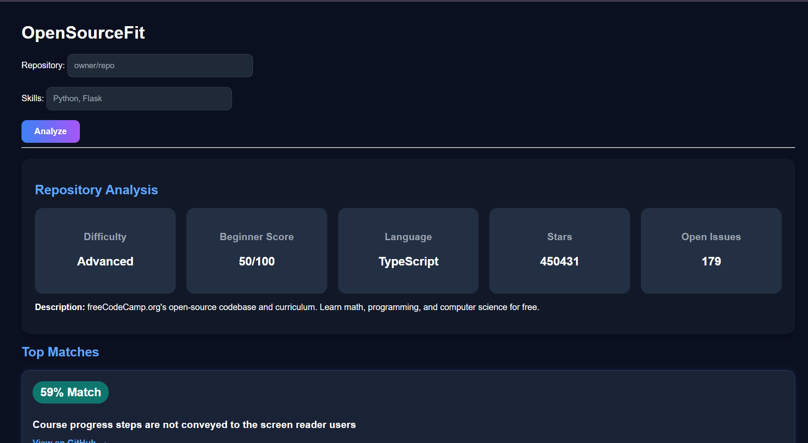
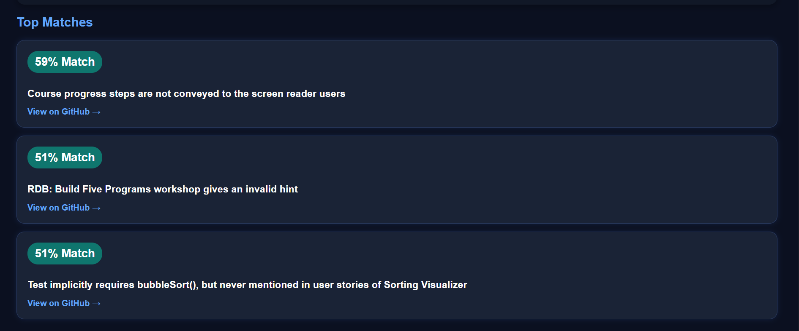

# 🚀 OpenSourceFit

OpenSourceFit helps developers discover suitable open-source contribution opportunities by analyzing GitHub repositories, evaluating project difficulty, and matching beginner-friendly issues with user skills using Machine Learning.

## 🌐 Live Demo

https://swethavarma05-opensourcefit-flask.hf.space

## 📖 Overview

Contributing to open-source projects can be overwhelming for beginners. Thousands of repositories exist on GitHub, but identifying projects that match a contributor's skills and experience level is often challenging.

OpenSourceFit addresses this problem by analyzing repositories, evaluating their beginner-friendliness, and recommending suitable contribution opportunities using Machine Learning and semantic similarity techniques.


## ✨ Features

### 🔍 Repository Analysis

Provides:

- Difficulty Level
- Beginner-Friendliness Score
- Primary Programming Language
- GitHub Stars
- Open Issues Count
- Repository Description

### 🤖 AI Skill Matching

Uses Sentence Transformers and semantic similarity to match user skills with relevant GitHub issues and contribution opportunities.

### 🎯 Beginner-Friendly Recommendations

Identifies contribution opportunities by filtering issues tagged with labels such as:

- good first issue
- help wanted
- beginner
- beginner friendly
- new contributor

### 🌐 Interactive Web Application

Provides a simple and intuitive web interface where users can analyze repositories and discover suitable open-source contribution opportunities.

## 🛠️ Tech Stack

### Backend

- Python
- Flask
- Requests

### Machine Learning

- Sentence Transformers
- all-MiniLM-L6-v2
- PyTorch

### Frontend

- HTML
- CSS

### APIs

- GitHub REST API

### Deployment

- Docker
- Hugging Face Spaces


## 🏗️ Project Architecture

User Input (Repository + Skills)
        ↓
GitHub API
        ↓
Repository Analysis
        ↓
Issue Collection
        ↓
Sentence Transformer Embeddings
        ↓
Semantic Similarity Matching
        ↓
Recommended Beginner-Friendly Issues


## ⚙️ How It Works

1. Enter a GitHub repository.
2. Enter your skills.
3. Repository information is fetched from the GitHub API.
4. Difficulty and beginner-friendliness are calculated.
5. Beginner-friendly issues are collected.
6. Semantic similarity is computed using Sentence Transformers.
7. Matching issues are ranked and recommended.

## 📸 Screenshots




---

## 🚀 Installation

Clone the repository:

```bash
git clone https://github.com/YOUR_USERNAME/OpenSourceFit.git
cd OpenSourceFit
```

Install dependencies:

```bash
pip install -r requirements.txt
```

Run locally:

```bash
python app.py
```

Open:

```bash
http://localhost:5000
```

## 📈 Future Improvements

- GitHub OAuth Login
- Personalized Repository Recommendations
- README Analysis
- Contribution Roadmaps
- Advanced Skill Matching
- Repository Ranking System

## 👩‍💻 Author

Swetha Varma K

## ⭐ Support

If you found OpenSourceFit useful, consider giving this repository a star ⭐ on GitHub.